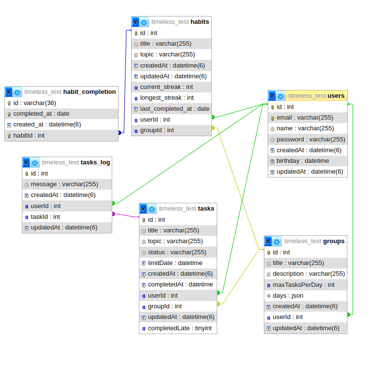

# Timeless

## Banco de dados

### Situação atual

## Backend
### CRUD Usuários
### CRUD Grupos

- Revisar se está tudo ok
- Criar um grupo automaticamente quando a conta for criada
### CRUD Tarefas

- repository
    - procurar todas tarefas de um usuário
    - procurar todas tarefas de um grupo
    - procurar pelo id
    - update
    - delete
    - patch (update parcial)
- service
    - completar tarefa
    - logica completedLate
    - agendamento/distribuição de tarefas (estou pensando em criar service especifico para isso)
- controller
- dtos
- routes
  - fazer estilo profile/tasks, profile/group/task

### CRUD Hábitos
- model
- repository
- service
- controller
- routes

### Distribuição de tarefas automático
- Integração com o backend e a rotas
### Gameficação

- Streak de Tarefas (dias seguidos realizando uma tarefa)
- Tarefas completadas
- Total de tarefas criadas
- Tabela especifica para gameficação

## Frontend

### Atualizar Senha
### Tela Grupos e Tarefas
- Modal Criação tarefas atualizado
- Modal Criação Grupos atualizado
- Modal atualizar dados dos grupos
- Modal atualizar dados das tarefas

## Rotas

/login
/profile
/profile/delete

post     /group 
get      /group
get      /group/:id
put      /group/:id
delete   /group/:id

