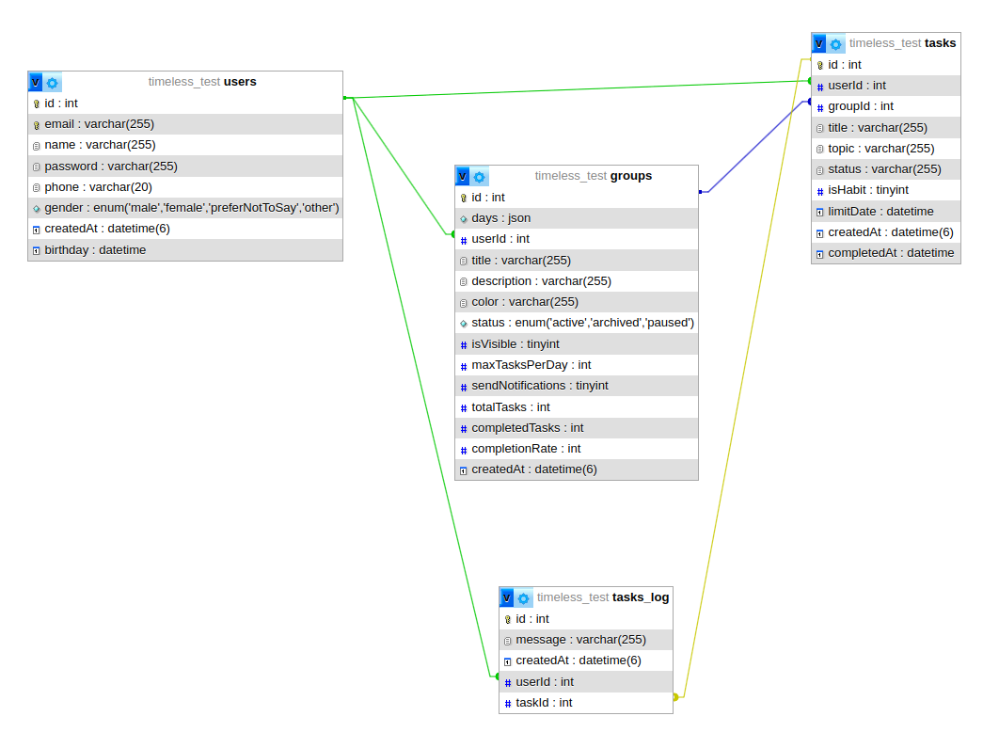

# Timeless

## Como rodar o projeto

## Banco de Dados

                        
## Rotas

### Auth

- POST    /login

Require: Authentication token

- GET     /me

### User

- POST    /users     -> create 

Require: Authentication token

- GET     /users     -> list
    
- PUT     /users/:id -> update
- DELETE  /users/:id -> delete

### Group

Require: Authentication token

- POST    /group     -> create 
- GET     /group     -> list
- GET     /group/:id -> getById
- PUT     /group/:id -> update
- DELETE  /group/:id -> delete

### Task

Require: Authentication token

- POST    /task     -> create 
- GET     /task     -> list
- GET     /task/:id -> getById
- PUT     /task/:id -> update
- DELETE  /task/:id -> delete
